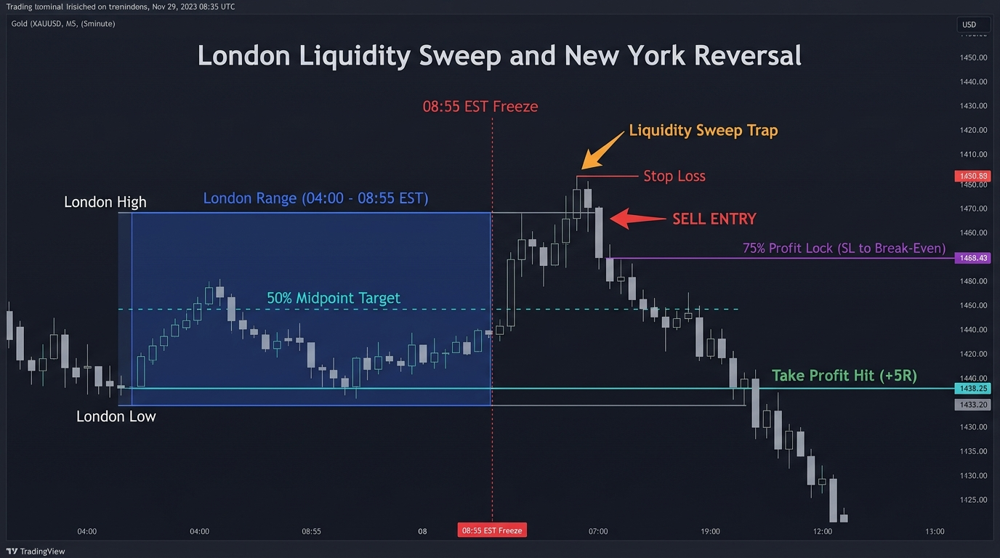

# Dineshfx - Forex & Commodities Algorithmic Trading Hub

A repository of institutional algorithmic trading strategies for **MetaTrader 5 (MT5)** and **TradingView**, optimized for **XAUUSD (Gold)**, Commodities, and Forex majors on **Vantage Markets** and **CPT Markets**.

---

## Active Strategy Catalog

| # | Strategy Name | Asset | Timeframe | Strategy Logic | Win Rate | Profit Factor | 13.5-Mo Net Return | Status |
| :---: | :--- | :---: | :---: | :--- | :---: | :---: | :---: | :---: |
| **01** | [**London Liquidity Sweep & NY Reversal**](strategies/01_London_Sweep_NY_Reversal/) | **XAUUSD** | **M5** | Institutional Judas Swing / Mean Reversion to 50% Midpoint + Profit Lock | **38.5%** | **1.62** | **+70.9 R (+70.9%)** | **Production** |



---

## Repository Structure

```text
Dineshfx/
├── README.md                                  # Repository overview and strategy index
├── .gitignore                                 # Git rules for MT5 & binary caches
└── strategies/
    └── 01_London_Sweep_NY_Reversal/           # Production Strategy: Liquidity Sweep & Mean Reversion
        ├── README.md                          # Full strategy mechanics & backtest report
        ├── assets/
        │   └── strategy_diagram.jpg           # Strategy chart flowchart and infographic
        ├── mql5/                              # MetaTrader 5 source & compiled binaries
        │   ├── London_Sweep_NY_Reversal_EA.mq5
        │   ├── London_Sweep_NY_Reversal_EA.ex5
        │   ├── London_Sweep_NY_Reversal_Indicator.mq5
        │   └── London_Sweep_NY_Reversal_Indicator.ex5
        └── tradingview/                       # TradingView Pine Script v6
            └── London_Sweep_NY_Reversal.pine
```

---

## News Protection Suite (EA v2.20)

To safeguard trading capital from violent economic reprecussions on Gold (CPI, NFP, FOMC), the EA includes 5 layers of protection:

1. **Auto-NFP Blocker (`InpFilterNFPFriday = true`)**: Automatically halts trading on the 1st Friday of every month (Non-Farm Payrolls).
2. **MT5 High-Impact USD News Filter (`InpFilterHighNews = true`)**: Reads MT5's native Economic Calendar and pauses trading 45 minutes before/after major events.
3. **On-Chart One-Click Pause Button (`InpShowNewsButton = true`)**: Directly click the green chart button to switch to `"⚠️ NEWS PAUSED"`.
4. **Date Blacklist (`InpSkipDatesList`)**: List specific dates to skip (e.g., `"2026.09.30, 2026.10.14"`).
5. **Spread Guard (`InpMaxSpreadPoints = 60`)**: Automatically skips entry if spread spikes during news.

---

## $100 Account Execution & VPS Economics

- **Lot Sizing**: Start with **`0.01 lot`**. In backtesting, 0.01 lot grew **$100 $\rightarrow$ $336.85 (+236.9%)** with 100% account survival. Trading 0.02 lot on $100 causes a margin call during normal losing streaks.
- **Account Doubling Milestone**: At 0.01 lot, the account reached **$206.09 on February 25, 2026 (~6.5 months, Trade #91)**. Scale to 0.02 lot only after passing $200.
- **VPS Overhead Warning**: A $15–$20/mo VPS costs $200–$270/year, wiping out small account profits. The EA only needs to run **2.5 hours per day (09:00 - 11:30 AM EST / 16:00 - 18:30 MT5 / 6:30 - 9:00 PM IST)**. Run for free on your home PC until account grows to $500+.

---

## 2026 Q4 High-Impact News Blacklist (Pre-Loaded into EA)

The following dates are pre-configured in `InpSkipDatesList` to automatically protect the account from CPI, NFP, and FOMC whipsaws:

- **October 2026**: `Oct 02` (NFP), `Oct 12` (Bank Holiday), `Oct 14` (CPI), `Oct 29` (GDP)
- **November 2026**: `Nov 04-05` (FOMC), `Nov 06` (NFP), `Nov 11` (Veterans Day), `Nov 12` (CPI), `Nov 26-27` (Thanksgiving / Black Friday)
- **December 2026**: `Dec 04` (NFP), `Dec 10` (CPI), `Dec 15-16` (FOMC), `Dec 24-25` (Christmas), `Dec 31` (New Year's Eve)

*On all other standard weekdays, the EA executes normal London Sweep & NY Reversals.*

---

## Broker Time Synchronization (Vantage Markets & CPT Markets)

Vantage Markets and CPT Markets MT5 servers run on **GMT+2 / GMT+3** (Cyprus server time, consistently **+7 hours ahead of New York EST**):

| Phase | US Eastern Time (EST/EDT) | Broker Server Time (GMT+3) | Parameter in EA / Indicator |
| :--- | :--- | :--- | :--- |
| **London Core Range Start** | 04:00 AM | **11:00** | `InpRangeStartTime = "11:00"` |
| **Pre-NY Freeze (5 min before NY)** | 08:55 AM | **15:55** | `InpRangeEndTime = "15:55"` |
| **NY Sweep Window Open** | 09:00 AM | **16:00** | `InpTradeStartTime = "16:00"` |
| **NY Sweep Window Close** | 11:30 AM | **18:30** | `InpTradeEndTime = "18:30"` |

---

## License
MIT License. Developed for algorithmic automated execution and backtesting on MetaTrader 5 and TradingView.
