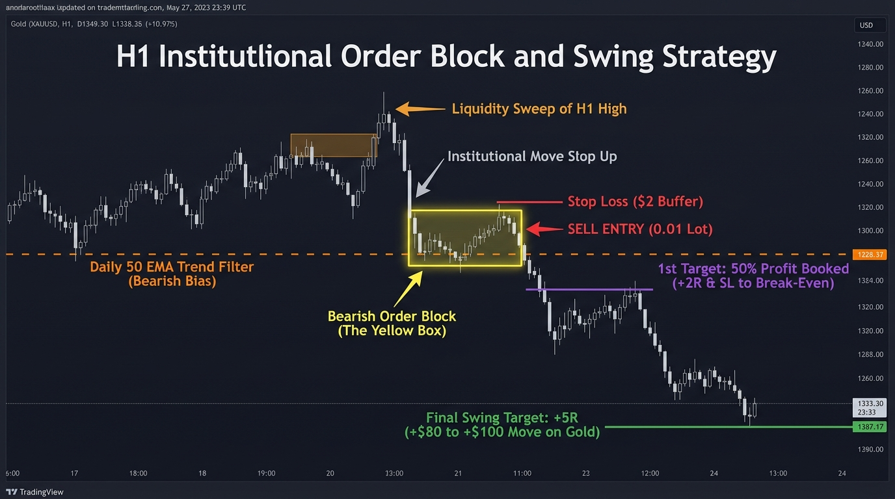

# Strategy 02: H1 Institutional Order Block & Swing Trader

A high-probability institutional swing trading system for **Gold (XAUUSD)** based on Higher Timeframe (Daily/H4) trend bias, Liquidity Sweeps, and H1 Order Block (Yellow Box) mitigation retests.

Inspired by multi-day swing holding mechanics, positioning with strict **0.01 micro-lots**, and booking **50% partial profit at +2.0R**.



---

## Performance Summary (10,000 H1 Candles / ~20 Months on Vantage Markets)

| Metric | 1:4.0 R:R Target (Recommended) | 1:5.0 R:R Target (Positional) |
| :--- | :---: | :---: |
| **Asset** | **XAUUSD (Gold)** | **XAUUSD (Gold)** |
| **Timeframe** | **H1 (1-Hour)** | **H1 (1-Hour)** |
| **Backtest Period** | Jan 17, 2025 – Sep 25, 2026 | Jan 17, 2025 – Sep 25, 2026 |
| **Total Trades** | 61 trades (~3 trades per month) | 61 trades (~3 trades per month) |
| **Win Rate** | **36.1%** | **34.4%** |
| **Profit Factor (PF)** | **2.18** 🏆 | **2.49** 🏆 |
| **Total Net Return (R)** | **+46.2 R** | **+59.7 R** |
| **Max Drawdown** | **-6.0 R** (Extremely safe) | **-9.0 R** |
| **Average Stop Loss** | ~$15.00 – $18.00 per ounce | ~$15.00 – $18.00 per ounce |
| **Target Distance** | **+$60.00 – $90.00 per ounce** | **+$75.00 – $120.00 per ounce** |

---

## Strategy Philosophy: "One Quality Trade a Week"

Unlike scalpers who stare at 1-minute charts, this swing strategy follows a relaxed, high-leverage edge:

1. **Daily Trend Filter (50 EMA)**:
   - Only SELL when Gold is in a downtrend below the Daily 50 EMA.
   - Only BUY when Gold is in an uptrend above the Daily 50 EMA.
2. **Liquidity Sweep**:
   - Price must sweep a previous significant swing high or low.
3. **The Yellow Box (Order Block & FVG)**:
   - An aggressive institutional displacement drop ($\ge \$8.00$ body) marks the origin Order Block candle.
   - The EA automatically draws the **Yellow Rectangle** on MT5 and TradingView.
4. **Retest Execution**:
   - Price retraces back into the Order Block zone.
   - Entry triggers on the retest boundary. Stop Loss is placed $\$2.00$ beyond the swing wick.
5. **Trade Management (50% Partial Close + BE)**:
   - When trade gains **+2.0R**: Close **50% of the position** to lock in initial profits, and move Stop Loss to **Break-Even**.
   - Runner position holds until full **1:4.0 or 1:5.0 R:R** target is hit!

---

## Sizing for a $100 Account (The 0.01 Lot Advantage)

- **Lot Size**: Strictly **`0.01 lot`**.
- **Dollar Risk per Trade**: With an average Stop Loss of $\$15.00$, a 0.01 lot trade risks **$\$15.00$**.
- **Max Drawdown Experienced**: Only **-6.0R**, meaning the account never experienced more than a temporary ~$\$60$ dip before catching massive $+\$60 \text{ to } +\$90$ swings.
- **Profit Potential**: Captures **$+\$60.00$ to $+\$120.00$ per winning trade**, generating explosive account growth on small capital without screen fatigue.

---

## File Structure

```text
strategies/02_H1_OrderBlock_Swing/
├── README.md                                  # Full strategy documentation & backtest report
├── assets/
│   └── strategy_diagram.jpg                   # Visual chart flowchart and infographic
├── mql5/
│   ├── H1_OrderBlock_Swing_EA.mq5             # Fully automated swing EA with 50% partial profit engine
│   ├── H1_OrderBlock_Swing_EA.ex5             # Compiled MT5 EA binary
│   ├── H1_OrderBlock_Swing_Indicator.mq5      # Visual chart indicator (draws yellow order block boxes)
│   └── H1_OrderBlock_Swing_Indicator.ex5      # Compiled MT5 indicator binary
└── tradingview/
    └── H1_OrderBlock_Swing.pine               # TradingView Pine Script v6 indicator with alert conditions
```
