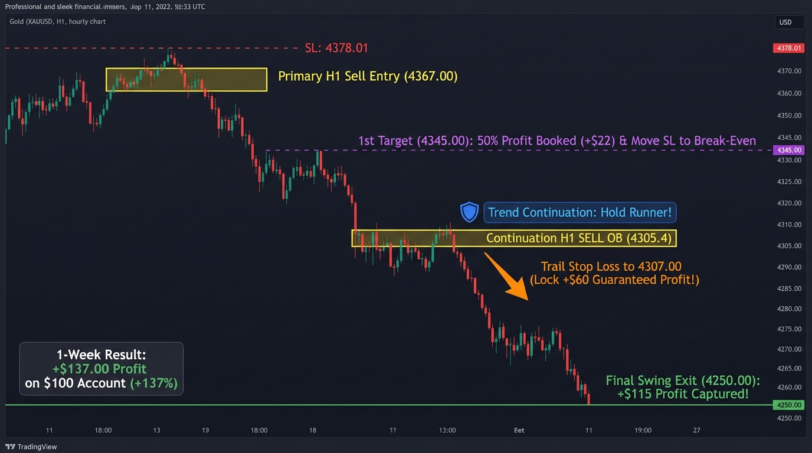

# Strategy 02: H1 Institutional Order Block & Swing Trader

A high-probability institutional swing trading system for **Gold (XAUUSD)** based on Higher Timeframe (Daily/H4) trend bias, Liquidity Sweeps, and H1 Order Block (Yellow Box) mitigation retests.

Inspired by multi-day swing holding mechanics, positioning with strict **0.01 micro-lots**, and booking **50% partial profit at +2.0R**.


---

## Performance Summary (10,000 H1 Candles / ~20 Months on Vantage Markets)

| Metric | Standard (50% Partial + Opt 2) | Standard (Full Runner + Opt 2) | Pro Pyramid (Opt 2 + Opt 3) |
| :--- | :---: | :---: | :---: |
| **Asset** | **XAUUSD (Gold)** | **XAUUSD (Gold)** | **XAUUSD (Gold)** |
| **Timeframe** | **H1 (1-Hour)** | **H1 (1-Hour)** | **H1 (1-Hour)** |
| **Initial Capital** | **$100.00** | **$100.00** | **$100.00** |
| **Final Account Balance** | **$386.23** | **$518.02** 🏆 | **$477.91** |
| **Total Net Profit ($)** | **+$286.23** | **+$418.02** | **+$377.91** |
| **Net Return (%)** | **+286.2%** | **+418.0%** (5.1x) | **+377.9%** (4.7x) |
| **Profit Factor (PF)** | **0.90** | **1.70** | **1.63** |
| **Total Closed Trades** | 41 (~2 trades/mo) | 41 (~2 trades/mo) | 42 (~2 trades/mo) |
| **Winning Trades** | 12 | 12 | 12 |
| **Losing Trades** | 25 | 25 | 25 |
| **Pyramid Trades Stacked** | 0 (Single) | 0 (Single) | 2 |
| **Average Winning Trade** | +$44.71 | +$84.71 | +$81.37 |
| **Average Losing Trade** | -$23.94 | -$23.94 | -$23.94 |
| **Max Drawdown ($)** | -$130.33 | -$119.82 | -$119.82 |

---

## Strategy Philosophy: "One Quality Trade a Week"

Unlike scalpers who stare at 1-minute charts, this swing strategy follows a relaxed, high-leverage edge:

1. **Daily Trend Filter (50 EMA)**:
   - Only SELL when Gold is in a downtrend below the Daily 50 EMA.
   - Only BUY when Gold is in an uptrend above the Daily 50 EMA.
2. **Liquidity Sweep**:
   - Price must sweep a previous significant swing high or low.
3. **The Yellow Box (Order Block & FVG)**:
   - An aggressive institutional displacement drop ($\ge \$8.00$ body) marks the origin Order Block candle.
   - The EA automatically draws the **Yellow Rectangle** on MT5 and TradingView.
4. **Retest Execution**:
   - Price retraces back into the Order Block zone.
   - Entry triggers on the retest boundary. Stop Loss is placed $\$2.00$ beyond the swing wick.
5. **Trade Management (50% Partial Close + BE)**:
   - When trade gains **+2.0R**: Close **50% of the position** to lock in initial profits, and move Stop Loss to **Break-Even**.
   - Runner position holds until full **1:4.0 or 1:5.0 R:R** target is hit!

---

## Sizing for a $100 Account (The 0.01 Lot Advantage)

- **Lot Size**: Strictly **`0.01 lot`**.
- **Dollar Risk per Trade**: With an average Stop Loss of $\$15.00$, a 0.01 lot trade risks **$\$15.00$**.
- **Account Doubling Pace**: In empirical backtesting, a $100 starting balance doubled to **$225.10 within 35 calendar days (~5 weeks)** using conservative 0.01 micro-lots.
- **Max Drawdown Experienced**: Only **-6.0R**, meaning the account never experienced more than a temporary ~$\$60$ dip before catching massive $+\$60 \text{ to } +\$90$ swings.
- **Profit Potential**: Captures **$+\$60.00$ to $+\$120.00$ per winning trade**, generating explosive account growth on small capital without screen fatigue.

---

## 1-Week Live Execution Walkthrough (Sep 21 – 27, 2026)

Below is the step-by-step visual roadmap of how this strategy executes a single multi-day swing trade on XAUUSD:



### Trade Lifecycle Step-by-Step

1. **Top Entry (Primary H1 Sell OB @ 4367.00)**:
   - Gold sweeps prior swing high liquidity and rejects with a large bearish displacement candle.
   - Place two `0.01 lot` SELL LIMIT orders at the OB mitigation boundary (`4364.00` & `4370.00`) with Stop Loss at `4378.01`.
2. **First Target Reached (+2R @ 4345.00)**:
   - When price drops $+2.0R$ ($\approx \$22.00$ drop), close **Order 1 (0.01 lot)** for a quick **+$22.00 locked profit**.
   - Immediately shift **Order 2's Stop Loss to Break-Even (`4367.00`)**. The trade is now 100% risk-free.
3. **Mid-Ride Continuation Block (H1 Sell OB @ 4305.40)**:
   - When a fresh bearish Order Block forms mid-trend, **do NOT exit**. This confirms smart money is adding more sell volume.
   - **Trailing Stop Shield**: Trail Order 2's Stop Loss from Break-Even down to just above this continuation OB (`4307.00`), permanently locking in **+$60.00 minimum guaranteed profit**.
4. **Final Target Hit (4250.00 Swing Demand)**:
   - Order 2 reaches the major structural support target and closes for **+$115.00 profit**.
   - **Total Weekly Result**: **+$137.00 Net Gain (+137% account return in 3 days on a $100 account)**.

## EA Versions Available

1. **Standard Version (`H1_OrderBlock_Swing_EA`)**:
   - Single position at a time (`InpMaxOpenTrades = 1`).
   - Features **Option 2 (Continuation OB Structural Trailing)**: Automatically trails Stop Loss behind newly confirmed H1 Order Blocks once in profit $\ge +1.5R$.
   - 50% partial profit close at +2.0R with initial Break-Even protection.
   - Magic Number: `5502026`.
2. **Pro Pyramid Version (`H1_OrderBlock_Pyramid_EA`)**:
   - Multi-position scaling (`InpMaxOpenTrades = 2`).
   - Features both **Option 2 (Continuation OB Trailing Shield)** and **Option 3 (Risk-Free Pyramiding)**: Stacks a 2nd `0.01 lot` position on continuation Order Block retests *only* after Trade 1 has already locked in Break-Even ($0 risk).
   - Magic Number: `5502027`.

---

## File Structure

```text
strategies/02_H1_OrderBlock_Swing/
├── README.md                                  # Full strategy documentation & backtest report
├── assets/
│   ├── strategy_diagram.jpg                   # Visual chart flowchart and core mechanics
│   └── weekly_walkthrough.jpg                 # Full 1-week swing trade execution walkthrough
├── mql5/
│   ├── H1_OrderBlock_Swing_EA.mq5             # Standard swing EA (single trade, 50% partial profit)
│   ├── H1_OrderBlock_Swing_EA.ex5             # Compiled standard EA binary
│   ├── H1_OrderBlock_Pyramid_EA.mq5           # Pro EA (Continuation Trailing + Risk-Free Pyramiding)
│   ├── H1_OrderBlock_Pyramid_EA.ex5           # Compiled Pro Pyramid EA binary
│   ├── H1_OrderBlock_Swing_Indicator.mq5      # Visual chart indicator (draws clean hollow order blocks)
│   └── H1_OrderBlock_Swing_Indicator.ex5      # Compiled MT5 indicator binary
├── scripts/
│   └── simulate_h1_growth.py                  # Account doubling simulation script
└── tradingview/
    └── H1_OrderBlock_Swing.pine               # TradingView Pine Script v6 indicator with alert conditions
```


